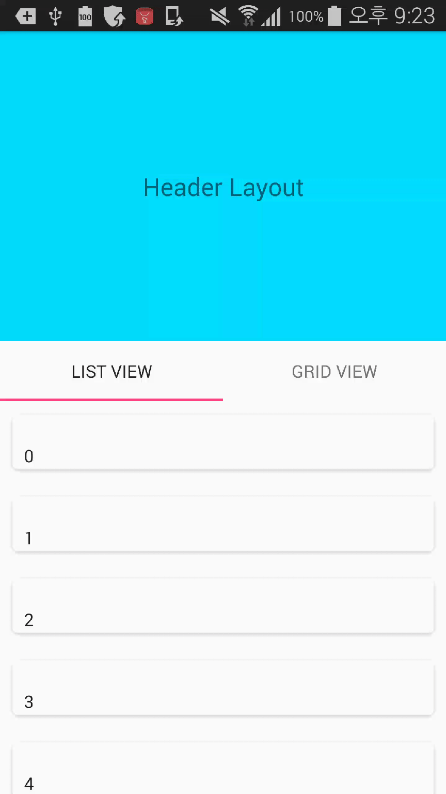

# CoordinatorLayoutHelper
[](https://android-arsenal.com/details/1/3101)

android custom coordinator layout behavior library and sample

CoordinatorLayoutHelper is an Android library that customize Coordinator Layout with Behavior with RecyclerView.
If you want to customize, It is very easy~~ 
Feel free to use it all you want in your Android apps provided that you cite this project.

Download
--------

Current version: [0.1.3]

Gradle:
```groovy
compile 'com.github.dubulee:coordinatorlayouthelper:0.1.3'
```

ScreenShot
------

How to Use
------
Using the library is really simple.

See MainActivity.java (app/src/main/java/com/github/dubulee/coordinatorlayouthelpersample/MainActivity.java)

First, Create HeaderLayout 

````java
HeaderLayout headerLayout = (HeaderLayout) findViewById(R.id.header_layout);
````

Second, Create CoordinatorLayoutHelperViewPager
````java
CoordinatorLayoutHelperViewPager viewPager = (CoordinatorLayoutHelperViewPager) findViewById(R.id.viewpager);
````

Third, Set Scroll Range
````java
headerLayout.setFixedScrollRange(HEIGHT);
````

Welcome the pull request
-------------------------

License
-------------------------
Copyright 2015 mugku

    Licensed under the Apache License, Version 2.0 (the "License");
    you may not use this file except in compliance with the License.
    You may obtain a copy of the License at

       http://www.apache.org/licenses/LICENSE-2.0

    Unless required by applicable law or agreed to in writing, software
    distributed under the License is distributed on an "AS IS" BASIS,
    WITHOUT WARRANTIES OR CONDITIONS OF ANY KIND, either express or implied.
    See the License for the specific language governing permissions and
    limitations under the License.
